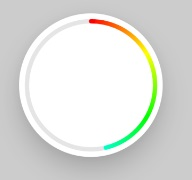

# Preview





# Usage

```javascript
import { CircleProgressView } from 'react-native-jjkit'

<CircleProgressView {...props} />

//Using animated value

Animated.createAnimatedComponent(CircleProgressView);

```


## Props   

| Name | description | type | default |
| --- | --- | --- | --- |
| strokeWidth | set the stroke width | Number | 4 |
| colors |  The colors to be distributed between around the center.There must be at least 2 colors in the array. | Array String  | all colors |
| positions | The relative position of each corresponding color in the colors array (0 to 1)  | Array Number |  spaced evenly  |
| backColors | back stroke colors  | Array String  | Light Gray |
| backPositions |  back stroke positions | Array Number |  spaced evenly  |
| cap |  set the line cap style (butt,round,square) | String | "butt" |
| progress | set the progress  | Number | 0 |


