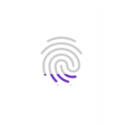

# Preview
Gravity:  top  - left - right -  bottom




# React native 
 
```javascript
import { ClipRectView } from 'react-native-jjkit'

<ClipRectView {...props} >
     <MyViewChild /> //View clipped 
</ClipRectView>

//using animated value

 Animated.createAnimatedComponent(ClipRectView)

```


## Props   

| Name | description | type | default |
| --- | --- | --- | --- |
| gravity | set the start of the Rect | String | "top" |
| inset | set inset relative to gravity, y(top,bottom) x(left,right) | Number | 0 |
| progress | set the [progress](../images/cliprecttopprogress.jpg) | Number | 0 |  

