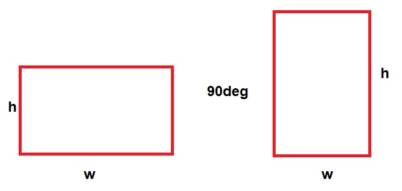
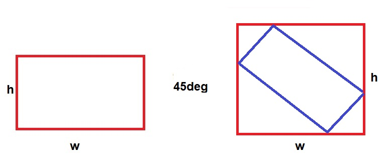

# Cropper

Image cropping  for React Native.


## Freatures

- [x] scale
- [x] scroll
- [x] rotation
- [x] flip

## Example

This is not a Component or view.

[demo](https://github.com/Only-IceSoul/canal/tree/master/demos/RNCropper)  


## Objects

**Cropper**

| key | description | type |
| --- | --- | --- |
| image | Base64 String or Static image uri | String | 
| rect | Image rect , relative to container | Rect | 
| rotate | degrees used on image rect ( clockwise )| Number | 
| flipVertically | Reflects the image top to bottom  | Bool | 
| flipHorizontally | Reflects the image left to right | Bool | 
| crop |Crop rect, relative to container | Rect | 

**Output** 

| key | description | type |   
| --- | --- | --- |
| width | The width for resize in pixels (fit center)  | Number |
| height | The height for resize in pixels (fit center) | Number |
| quality | The quality 0 to 1, png will ignore the quality | Number |
| format |The format of the compressed image Cropper.jpeg(0) or Cropper.png(1)  | Number |

If you don't want to resize the image cropped , set width -1 and height -1

**Rect** 


| key | type |
| --- | --- |
| left | Number | 
| top |  Number | 
| right |  Number | 
| bottom |  Number | 


## Usage

### transform

```javascript

 let base64 = "base64,QEQWEQWeqwesd/asdmlmlzz"
 let staticUri = `static;${image.uri}`
  
  let data = {
        image : staticUri, 
        rotate: 90,
        flipVertically: false,
        flipHorizontally: false,
        output: {
            quality: 1,
            format: Cropper.jpeg,
            width: -1, 
            height: -1  
        }
    }


  Cropper.transform(data).then(re=>{
      let img64 = re
  })

```

### Crop

Everything is with logical numbers, like when you define width and height in a view

```javascript
import { Cropper , Rect } from 'react-native-jjkit'

//define ur container 
let cw = 814 //width
let ch = 414 //height
// image size in pixels
let imageWidth = 1200
let imageHeight = 460


let imageRect = Rect.fitCenterRect(imageWidth,imageHeight,cw,ch)
let cropRect = Rect.centerRect(100,100,cw,ch)

//validate rect
//return true if first rect contains second rect
 if (Rect.contains(imageRect,crop)){

 let base64 = "base64,QEQWEQWeqwesd/asdmlmlzz"
 let staticUri = `static;${image.uri}`

        let data = {
            image : staticUri,
            rect: imageRect,
            crop: cropRect,
            rotate : 0,
            flipVertically: false,
            flipHorizontally: false,
            output: {
                quality: 1,
                format: Cropper.png,
                width: -1,
                height: -1
            }
        }


      Cropper.makeCrop(dataForCrop).then(image64String => {
            console.log("result ",image64String)
           
        })
}


```

## Rect

**Transform**

When you transform view, you have to update also in the rect.

cropView -> cropRect  
imageView -> imageRect

You can use ur own functions for transform the rect(scale and scroll).

```javascript

import { Rect } from 'react-native-jjkit'

//scroll
 myRect = Rect.offset(myRect,distanceX,distanceY)

 //scale focus center
  myRect = Rect.scale(myRect,scale)
 //inset 
 myRect =  Rect.inset(myRect,inseX,insetY)
 //top left
 myRect =  Rect.insetTl(myRect,inset)
  //top left right
 myRect =  Rect.insetTlr(myRect,inset)
//....


```

**Rotation**

How it's work.

```javascript
//clockwise
 myRect =  Rect.rotate(myRect,degrees)
```

even



odd



