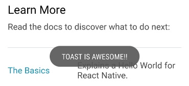

# Toast



# React native 

duration:

```swift
Toast.SHORT   //0
Toast.LONG    //1 

```


```javascript
import { Toast } from 'react-native-jjkit'

<touchableView onPress={()=>{
    Toast.show("mymessage",Toast.SHORT)
}} 
 />


```

